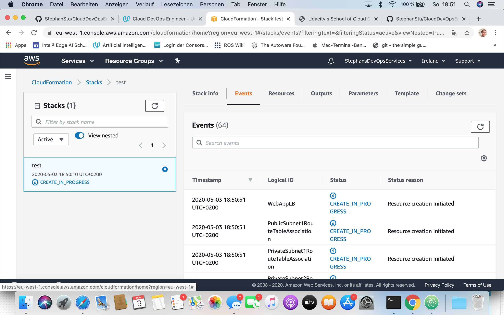

# My Solution for one Project of Udacity's Cloud DevOps Engineer Nanodegree Program - Deployment of a High-Availability Web App using CloudFormation
This repository contains my solution for one project of Udacity's Cloud DevOps Engineer Nanodegree Program - The Deployment of a High-Availability Web App using CloudFormation.

## Project-Requirements: Context
A company is creating a web application. Developers will push the latest version of their code in a zip file located in a public S3 Bucket.
The creation of the infrastructure for this application eeds to be done in an automated fashion so that the infrastructure can be discarded as soon as the testing team finishes their tests and gathers their results.

## Project-Requirements: Server specs
A Launch Configuration is needed for application servers in order to deploy four servers, two located in each of the private subnets. The launch configuration will be used by an auto-scaling group.
Two vCPUs are needed with at least 4GB of RAM. The Operating System to be used is Ubuntu 18.
At least 10GB of disk space are required to avoid running into issues.

## Project-Requirements: Security Groups and Roles
The application archive will be downloaded from an S3 Bucket; hence an IAM Role that allows instances to use the S3 Service is needs to be created.
The application communicates on the default HTTP Port: 80, so servers will need this inbound port open. One will use it with the Load Balancer and the Load Balancer Health Check. As for outbound, the servers will need unrestricted internet access to be able to download and update its software.
The load balancer should allow all public traffic (0.0.0.0/0) on port 80 inbound, which is the default HTTP port. Outbound, it will only be using port 80 to reach the internal servers.
The application needs to be deployed into private subnets with a Load Balancer located in a public subnet.
One of the output exports of the CloudFormation script is the public URL of the LoadBalancer.

## Solution: Deployment
After downloading, installing the AWS command-line interface (AWS CLI, see [here](https://docs.aws.amazon.com/cli/index.html)),
deployment on your machine takes two steps. First, 'create.sh' must be given execution permissions  on the local machine. Then the 'create.sh' must be called with the desired name of the stack and reference to both the infrastructure and it's parameters.
### Enable 'create.sh' on your machine
On MAC-OS or Linux give execution permissions to 'create.sh' by

$ chmod u+x create.sh
### Create stack using CloudFormation
A user is needed which has rights _arn:aws:iam::aws:policy/AdministratorAccess_. The AWS CLI has to be configured with this user first. Then on MAC-OS or Linux create the infrastructure by

$ ./create.sh test infrastructure.yml parameters.json

_test_ can be replaced by another name for the stack, e.g. _MyStack_ or _my_infra_. It is the name that appears in CloudFormation/Stacks.
The creation of the stack will take some time. Progress can be observed in CloudFormation/Stacks as displayed below.

**Note**: Instances will be created in AvailabilityZone _!Select [ 0, !GetAZs '' ]_ - in the author's account this creates servers in Ireland. This can be observed in the console. The response of the AWS CLI reads as follows:

{

    "StackId": "arn:aws:cloudformation:eu-west-1:793553224113:stack/test/2693bcc0-8d5e-11ea-bd6c-0609694b6370"

}

**Note**: In line 271 of _infrastructure.yml_, change the file-URL to whatever-index.html is provided in order to host another static website. Currently, the index file of the first project of the first project of Udacity's Cloud DevOps Engineer Nanodegree Program is added here and will be displayed as long as the bucket exists.
